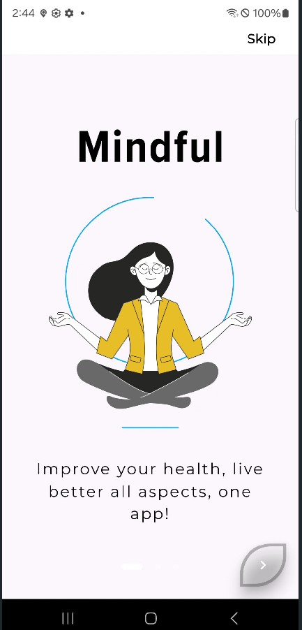
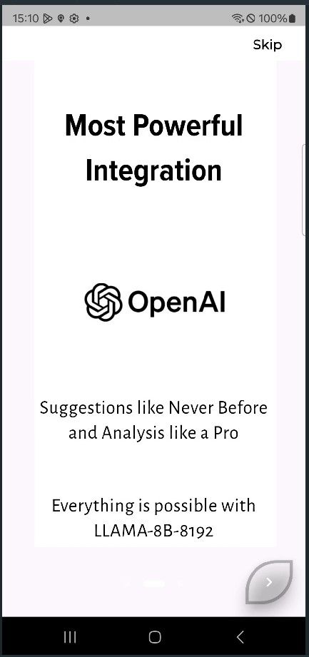

TO DO : UI IMPROVE 

**APP STATUS** : ALL CORE FUNCTIONALITIES WORKING (NodeJs on LOCALHOST)

# Mindful

  

**Your Personal Mental Wellness Companion**

## Table of Contents

- [Overview](#overview)
- [Features](#features)
- [Technologies Used](#technologies-used)
- [Architecture](#architecture)
- [Getting Started](#getting-started)
- [Usage](#usage)
- [Contributing](#contributing)
- [License](#license)
- [Contact](#contact)

## Overview
In a world where stress and anxiety are increasingly common, *Mindful* serves as a sanctuary for mental health. This innovative application empowers users to enhance their well-being through personalized advice and relaxation techniques. By integrating advanced AI technology, *Mindful* provides tools to help users cultivate mindfulness and manage their mental health effectively.

## Features
- **Personalized Advice**: Experience tailored guidance powered by Gemini, an advanced AI designed to understand your unique mental health needs. Future upgrades will allow integration with Anthropic, OpenAI, and Mistral, enhancing the support provided.
  
- **Relaxation Music Player**: Immerse yourself in a curated selection of soothing tracks. The built-in music player is designed to help users unwind, recharge, and foster a peaceful environment for relaxation.

- **User-Friendly Interface**: Navigate effortlessly through an intuitive design that makes accessing mental health resources easy and enjoyable.





## Technologies Used
- **Backend**: 
  - **Node.js**: A powerful JavaScript runtime for building scalable network applications.
  - **PostgreSQL**: An advanced relational database for storing user data securely.
  - **Firebase**: A comprehensive platform for building web and mobile applications with real-time data syncing.

- **Architecture**: 
  - **Clean Architecture**: Ensures the application is modular and maintainable.
  - **SOLID Principles**: Follows best practices for software development, promoting scalability and ease of testing.

## Architecture
The *Mindful* app employs a clean architecture pattern, allowing for separation of concerns and enhancing maintainability. This design makes the app adaptable to future changes and ensures a robust user experience. By adhering to SOLID principles, *Mindful* promotes best practices that facilitate development and testing.

## Getting Started
To run *Mindful* locally, follow these steps:

1. **Clone the repository**:
   ```bash
   git clone https://github.com/ARYPROGRAMMER/mindful.git
   cd server/mental-health-api/
   ```

2. **Install dependencies**:
   ```bash
   npm install
   ```

3. **Setup environment variables (OPTIONAL, USE MINE)**:
  Changes in API_KEY (if needed) to be done in : 

   ```plaintext
   mental-health-api/
   ├──...          
   ├──...         
   ├──...          
   ├──...        
   ├── server.js          # Main server file
   ├── infrastructure/               
       ├── geminiai/   
       ├   └── geminiService.js  # NEW API KEY ADDING SLOT
       └──── db/    
              └── index.js  # PostGres Setup
   
   ```

4. **Run the Server**:
   ```bash
   npm start
   ```
   
5. **Run the App**:
   ```bash
   cd ../../lib/
   flutter clean
   flutter pub get
   flutter run
   
   ```
   Alternatively you could use :
   ```bash
   flutter build apk
   ```
   
**MORE SCREENSHOTS**

*Model*


*Home*


*Song Playlist*


*Settings*


*Backend*


## Usage
- After starting the app, navigate to `http://localhost:6000/medidation/dailyQuotes` in Postman or API Dash to check working.
- Explore all the sections to receive personalized mental health tips based on your needs.
- Use the music player to listen to relaxing tracks and enhance your mindfulness practice.


## References
- **Machine Learning Model**: [Colab Notebook](https://colab.research.google.com/drive/177N-KOyAHfuTYAC0UyukEh7iiiQLL1jq?usp=sharing)  
  This notebook contains the ML model used in the app. Feel Free to Clone and Modify.

- **UI Inspiration**: [Figma File](https://www.figma.com/design/WoPdJjhluqyJHHm8FaysPt/Mental-Health-App-Design-(Community)?node-id=0-1&t=BJUL3kdEOYtKaZlw-0)  
  Explore the Figma file for design inspiration and UI components.

## Contributing
We welcome contributions to improve *Mindful*! Please follow these steps:
1. Fork the repository.
2. Create a new branch (`git checkout -b feature/YourFeature`).
3. Make your changes and commit them (`git commit -m 'Add some feature'`).
4. Push to the branch (`git push origin feature/YourFeature`).
5. Open a Pull Request.

## License
This project is licensed under the MIT License. See the [LICENSE](LICENSE.txt) file for details.

## Contact
For questions or feedback, please reach out to me at:
- **Email id**: [arya.2023ug1104@iiitranchi.ac.in](mailto:arya.2023ug1104@iiitranchi.ac.in)
- **GitHub**: [ARYPROGRAMMER](https://github.com/ARYPROGRAMMER)

---
*Mindful* I invite you to join a community focused on mental health and well-being. Together, we can create a positive impact, one mindful moment at a time. PRs ARE APPRECIATED
