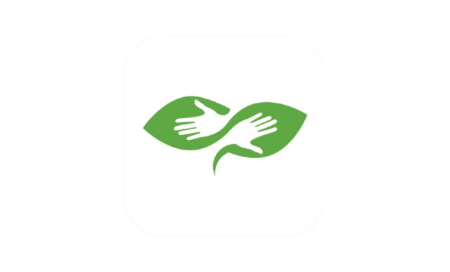
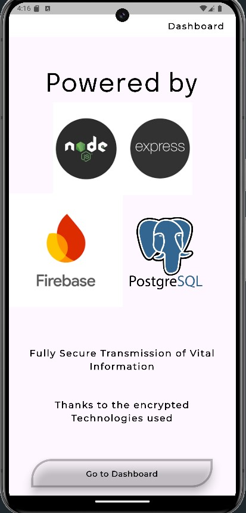
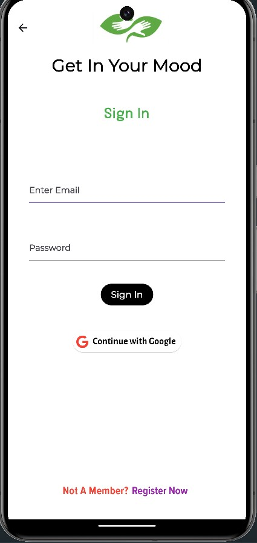
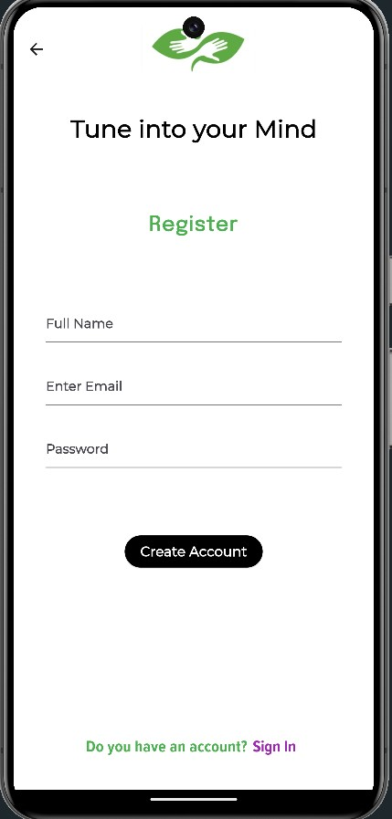
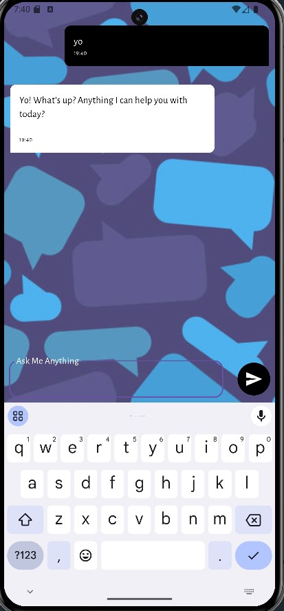
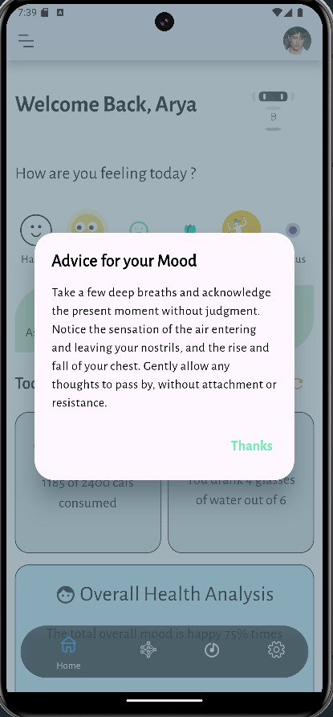
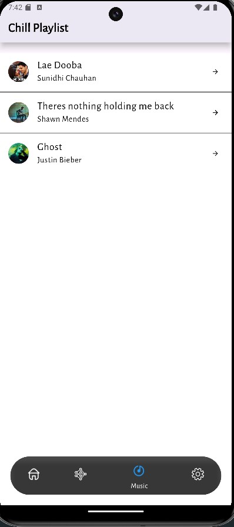
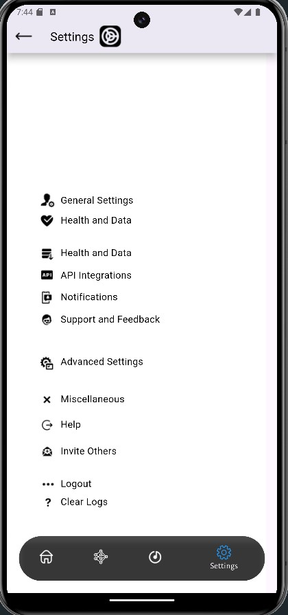
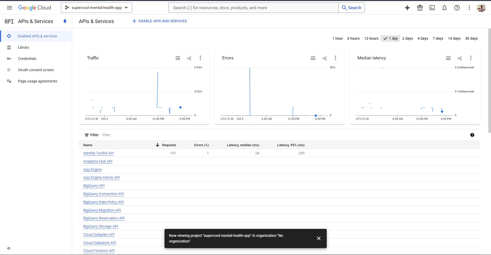
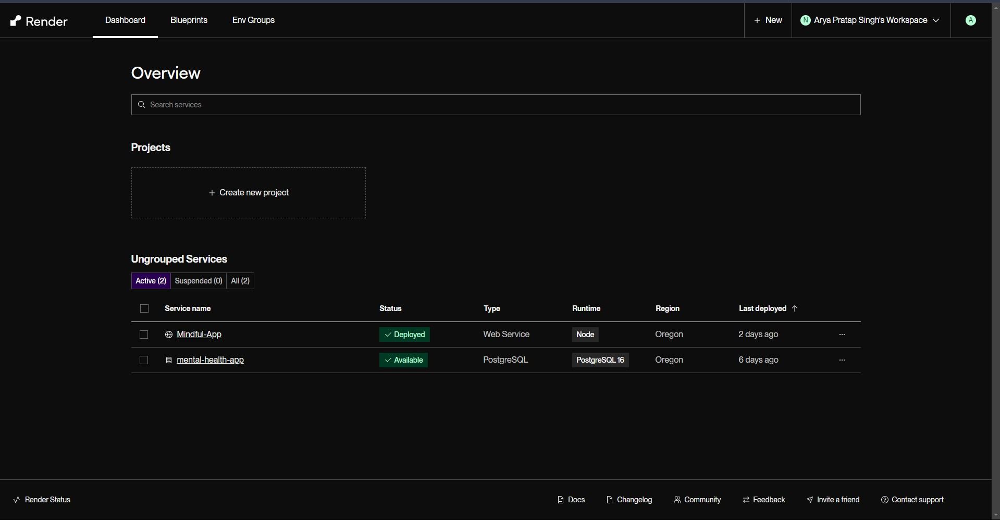

**IMPORTANT : Backend Services Working**


<p align="center">
    <a href="https://github.com/ARYPROGRAMMER/Mindful-App/actions">
        
    </a>
    
</p>

<p align="center">
    
    
</p>


**AI USED** : LLAMA-8B-8192, FACE EMOTION RECOGNITION MODEL, GEMINI/ANTHROPIC/MISTRAL SUPPORTED (API_KEY REQUIRED)

**APP STATUS** : ALL CORE FUNCTIONALITIES WORKING (Deployed NodeJs & Postgresql on Render)

## What's New in v2.1.2 (**Stable Release with Redis Phase 3 Integration**)

            - **Improved AI Chat Functionality**
            - **Redis DS Change - HashMaps**
            - **Minor Bug fixes**
            - **Crash Handlers are improved**
            - **Improved Overall Performance - Implemented Impeller**
            - **Settings Tab is now Better**
            - **Redis connection fixes and data privacy improvised**
            - **Redis Cloud Implementation and Fetching in Beta Phase**
            - **Added Redis-base to support syncfusion**
            - **New Feature**: Implemented Syncfusion and Redis for low latency**
            
            ### Issues are being Resolved - Redis Full-Integration Phase 3

[DEMO LINK OF WORKING](https://vimeo.com/1016496824?share=copy)

[PRE-PRODUCTION INSIDERS](https://vimeo.com/1013864504)

[Blog Post on dev.to](https://dev.to/aryprogrammer/building-mindful-a-mental-wellness-app-with-nodejs-ai-and-clean-architecture-3n9d)

# Mindful

  

**Personal Mental Wellness Companion**

## Table of Contents

- [Overview](#overview)
- [Features](#features)
- [Technologies Used](#technologies-used)
- [Architecture](#architecture)
- [Getting Started](#getting-started)
- [Usage](#usage)
- [Contributing](#contributing)
- [License](#license)
- [Contact](#contact)

## Overview
In a world where stress and anxiety are increasingly common, *Mindful* serves as a sanctuary for mental health. This innovative application empowers users to enhance their well-being through personalized advice and relaxation techniques. By integrating advanced AI technology, *Mindful* provides tools to help users cultivate mindfulness and manage their mental health effectively.

## Features
- **Personalized Advice**: Experience tailored guidance powered by *LLAMA-8B-8192* (previously : Gemini) (Since its free) an advanced AI fine tuned to understand your unique mental health needs. Use your API_KEY to integrate with Anthropic, OpenAI, and Mistral, enhancing the support provided. **Code is already provided for them**.
  
- **Relaxation Music Player**: Immerse yourself in a curated selection of soothing tracks. The built-in music player is designed to help users unwind, recharge, and foster a peaceful environment for relaxation.

- **User-Friendly Interface**: Navigate effortlessly through an intuitive design that makes accessing mental health resources easy and enjoyable.

- **Face Detection Model** : Analyze your mood with your facial expressions, this can be further linked to different services.

  










## Technologies Used
- **Backend**: 
  - **Node.js**: A powerful JavaScript runtime for building scalable network applications.
  - **PostgreSQL**: An advanced relational database for storing user data securely.
  - **Firebase**: A comprehensive platform for building web and mobile applications with real-time data syncing.
  - **Tensorflow**: To Create the FER Model using FER2013 Dataset.

- **Architecture**: 
  - **Clean Architecture**: Ensures the application is modular and maintainable.
  - **SOLID Principles**: Follows best practices for software development, promoting scalability and ease of testing.

## Architecture
The *Mindful* app employs a clean architecture pattern, allowing for separation of concerns and enhancing maintainability. This design makes the app adaptable to future changes and ensures a robust user experience. By adhering to SOLID principles, *Mindful* promotes best practices that facilitate development and testing.

#### Key Architectural Decisions:
- **ModelView-ViewModel pattern** to handle user requests and business logic.
- **Separation of concerns** for better code management and maintainability.
- **Extensibility** built-in so new AI features and wellness tools can be integrated smoothly in future updates.

To run *Mindful* locally, follow these steps:

1. **Clone the repository**:
   ```bash
   git clone https://github.com/ARYPROGRAMMER/mindful.git
   cd server/mental-health-api/
   ```

2. **Install dependencies**:
   ```bash
   npm install
   ```

3. **Setup environment variables (OPTIONAL, USE MINE)**:
  Changes in API_KEY (if needed) to be done in : 

   ```plaintext
   mental-health-api/
   ├──...          
   ├──...         
   ├──...          
   ├──...        
   ├── server.js          # Main server file
   ├── infrastructure/               
       ├── geminiai/   
       ├   └── geminiService.js  # NEW API KEY ADDING SLOT
       └──── db/    
              └── index.js  # PostGres Setup
   
   ```

4. **Run the Server**: (Not Needed after v1.0.6)
   ```bash
   npm start
   ```
   
5. **Run the App**:
   ```bash
   cd ../../lib/
   flutter clean
   flutter pub get
   flutter run
   
   ```
   Alternatively you could use :
   ```bash
   flutter build apk
   ```
5. **Structure of DB**:

    # Songs Table
    
        YOU NEED TO CREATE THIS YOURSELF IN POSTGRESQL (Not Needed after v1.0.6)
    
        This is the structure of the `songs` table in the `public` schema.
        
        | Column   | Type                   | Collation | Nullable | Default                                |
        |----------|------------------------|-----------|----------|----------------------------------------|
        | `title`  | `character varying(100)`|           | `false`  |                                        |
        | `author` | `character varying(100)`|           | `false`  |                                        |
        | `songlink`| `character varying(256)`|          | `false`  |                                        |
        | `id`     | `bigint`                |           | `false`  | `nextval('songs_id_seq'::regclass)`    |
        | `imageid`| `character varying(256)`|           | `true`   |                                        |
        
        ### Notes:
        - The `id` column is auto-incremented using the `nextval('songs_id_seq'::regclass)` function.
        - `imageid` is optional and can store a link or identifier for the image associated with the song.

    Query:

   `CREATE TABLE public.songs (
    id BIGSERIAL PRIMARY KEY,
    title VARCHAR(100) NOT NULL,
    author VARCHAR(100) NOT NULL,
    songlink VARCHAR(256) NOT NULL,
    imageid VARCHAR(256)
    );
    `

7.  **PROVIDE CONNECTION IN FLUTTER** : (NOT NEEDED AFTER v1.0.6)
    
    ```bash
    cd lib/features/meditation/data/meditation_remote_source.dart
    cd lib/features/music/data/song_database.dart
    ```
    Give your IPv4 in the Uri.Parse url. ("mine starts with 192").

**MORE SCREENSHOTS**

*Model*


*Home*



*Song Playlist*


*Settings*


*Backend*





## Usage
- Explore all the sections to receive personalized mental health tips based on your needs.
- Use the music player to listen to relaxing tracks and enhance your mindfulness practice.
- Explore the FER MODEL Section (NOT Fully Developed).


## References
- **Machine Learning Model**: [Colab Notebook](https://colab.research.google.com/drive/177N-KOyAHfuTYAC0UyukEh7iiiQLL1jq?usp=sharing)  
  This notebook contains the ML model used in the app. Feel Free to Clone and Modify.

- **UI Inspiration**: [Figma File](https://www.figma.com/design/WoPdJjhluqyJHHm8FaysPt/Mental-Health-App-Design-(Community)?node-id=0-1&t=BJUL3kdEOYtKaZlw-0)  
  Explore the Figma file for design inspiration and UI components.

## Contributing
We welcome contributions to improve *Mindful*! Please follow these steps:
1. Fork the repository.
2. Create a new branch (`git checkout -b feature/YourFeature`) (DONT USE MAIN).
3. Make your changes and commit them (`git commit -m 'Add some feature'`).
4. Push to the branch (`git push origin feature/YourFeature`).
5. Open a Pull Request.

## License
This project is licensed under the MIT License. See the [LICENSE](LICENSE.txt) file for details.

## Contact
For questions or feedback, please reach out to me at:
- **Email id**: [arya.2023ug1104@iiitranchi.ac.in](mailto:arya.2023ug1104@iiitranchi.ac.in)
- **GitHub**: [ARYPROGRAMMER](https://github.com/ARYPROGRAMMER)

---
*Mindful* - I invite you to join a community focused on mental health and well-being. Together, we can create a positive impact, one mindful moment at a time. PRs ARE APPRECIATED
